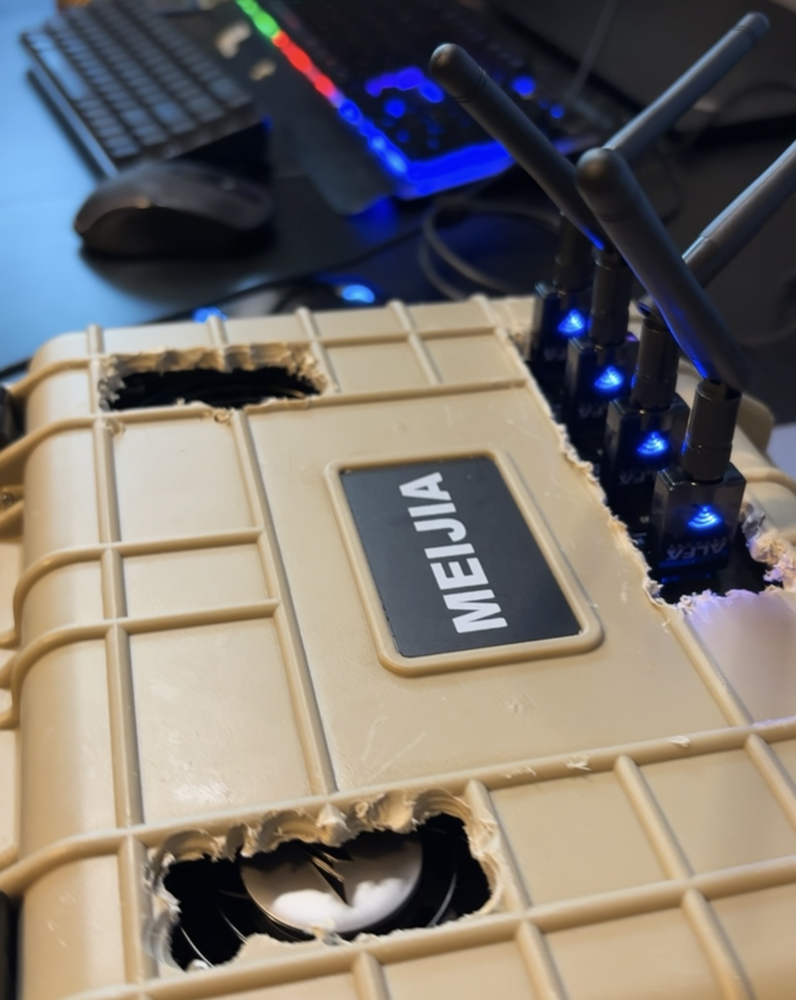

<div align="center">


<br/>

```
██████╗  ██████╗  ██████╗ ██╗  ██╗██╗   ██╗
██╔══██╗██╔═══██╗██╔═══██╗██║ ██╔╝██║   ██║
██║  ██║██║   ██║██║   ██║█████╔╝ ██║   ██║
██║  ██║██║   ██║██║   ██║██╔═██╗ ██║   ██║
██████╔╝╚██████╔╝╚██████╔╝██║  ██╗╚██████╔╝
╚═════╝  ╚═════╝  ╚═════╝ ╚═╝  ╚═╝ ╚═════╝
```



<br/>


</div>

---

<div align="center">

### ⚔️ *By a Star Wars Nerd* ⚔️

> **"I have become more powerful than any Jedi."** — Count Dooku

</div>

---

> ⚠️ Currently in active development and testing. Features are being built and pushed regularly.

Portable wardriving rig built inside a hardened case. Raspberry Pi 5 running Kali Linux headless, multiple WiFi adapters, boots headless and runs fully automated.

---

## What It Does

| | |
|---|---|
| 📡 **AP on boot** | Pi creates its own WiFi hotspot (SSID: `Dooku`). Connect your phone, open `10.10.10.1:5000` |
| 📊 **Live dashboard** | FLOCK tab shows real-time WiFi and BLE detections. KISMET tab opens Kismet's native wardriving UI |
| 🔍 **flock-back** | Full WiFi and BLE wardriving powered by [flock-back](https://github.com/nsm-barii/flock-back) |
| 🌐 **Kismet** | RF wardriving across all monitor-mode adapters, accessible at `10.10.10.1:2501` |
| 📶 **Multi-adapter** | All non-AP adapters scanning simultaneously across 2.4GHz and 5GHz |
| ⚙️ **Auto-start** | Plug in and everything comes up on its own via systemd |
| 🔒 **SSH MODE** | Tap button on dashboard to drop AP and hand `wlan0` back for SSH access |

---

## Hardware

```
┌─────────────────────────────────┐
│  Raspberry Pi 5 (8GB)           │
│  Kali Linux Headless (64-bit)   │
│  ALFA AWUS1900  — RTL8814AU     │
│  ALFA AWUS036ACS — RTL8821AU    │
│  Powered USB hub                │
│  Hardened carry case            │
│  Portable battery bank          │
└─────────────────────────────────┘
```

---

## Setup

```bash
sudo bash scripts/setup.sh
```

Installs all dependencies, drivers, and registers the `dooku` systemd service. Reboot when done.

---

## About

Created by **NSM-Barii** — Star Wars nerd | Cybersecurity enthusiast

**NSM Toolset:**
| Tool | Purpose |
|---|---|
| [Vader](https://github.com/nsm-barii/vader) | Recon & discovery |
| [Maul](https://github.com/nsm-barii/maul) | Infrastructure mapping |
| **Dooku** | Wardriving rig *(this)* |

---

<div align="center">

*"Your swords, please. We don't want to make a mess of things."*

**Disclaimer:** For educational, ethical, and legal purposes only.

</div>
